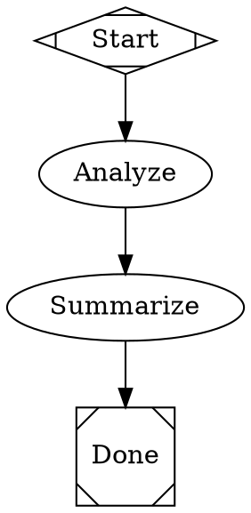
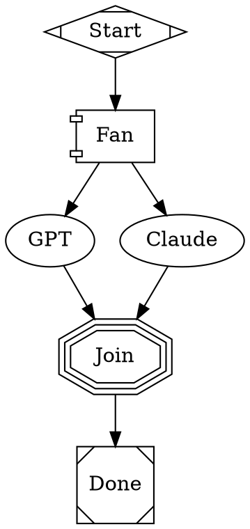

# Attractor Dashboard API

You can interact with a running Attractor Pipeline Dashboard using `curl` via bash.

**Base URL:** `http://localhost:8050` (default)

## Quick Reference

| Action | Command |
|--------|---------|
| List all pipelines | `curl -s http://localhost:8050/api/pipelines` |
| Submit a pipeline | `curl -s -X POST http://localhost:8050/api/pipelines -H "Content-Type: application/json" -d '{"dot_source": "digraph { ... }"}'` |
| Get pipeline detail | `curl -s http://localhost:8050/api/pipelines/{context_id}` |
| Get node detail | `curl -s http://localhost:8050/api/pipelines/{context_id}/nodes/{node_id}` |
| Cancel a pipeline | `curl -s -X POST http://localhost:8050/api/pipelines/{pipeline_id}/cancel` |
| Stream events (SSE) | `curl -N http://localhost:8050/api/pipelines/{pipeline_id}/events` |
| List pending gates | `curl -s http://localhost:8050/api/pipelines/{pipeline_id}/questions` |
| Answer a gate | `curl -s -X POST http://localhost:8050/api/pipelines/{pipeline_id}/questions/{question_id}/answer -H "Content-Type: application/json" -d '{"answer": "yes"}'` |
| Health check | `curl -s http://localhost:8050/api/health` |

## Endpoints

### List Pipelines — `GET /api/pipelines`

Returns all known pipeline instances (fleet view).

```bash
curl -s http://localhost:8050/api/pipelines | python3 -m json.tool
```

Response fields per pipeline: `context_id`, `pipeline_id`, `status`, `nodes_completed`, `nodes_total`, `total_elapsed_ms`, `total_tokens_in`, `total_tokens_out`, `goal`, `errors[]`, `start_time`.

Status values: `"pending"`, `"running"`, `"complete"`, `"failed"`, `"cancelled"`.

### Submit Pipeline — `POST /api/pipelines`

Submit DOT source to start a new pipeline execution. Returns immediately with pipeline ID while execution runs in background.

```bash
curl -s -X POST http://localhost:8050/api/pipelines \
  -H "Content-Type: application/json" \
  -d '{
    "dot_source": "digraph MyPipeline {\n  Start [shape=Mdiamond];\n  Do [prompt=\"Hello world\", llm_provider=\"anthropic\", llm_model=\"claude-sonnet-4-6\"];\n  Done [shape=Msquare];\n  Start -> Do -> Done;\n}",
    "goal": "optional goal description"
  }'
```

Response: `{"pipeline_id": "MyPipeline-a3f2b1c0", "status": "running", "logs_root": "/tmp/..."}` (201 Created)

Errors: 422 (invalid DOT), 503 (executor not configured).

### Pipeline Detail — `GET /api/pipelines/{context_id}`

Full state for a single pipeline including DOT source, node states, and execution details.

```bash
curl -s http://localhost:8050/api/pipelines/{context_id} | python3 -m json.tool
```

Use `context_id` from the fleet list (not `pipeline_id`).

### Node Detail — `GET /api/pipelines/{context_id}/nodes/{node_id}`

Detail for a single node — metadata, all run attempts, prompt/response, edge routing decisions.

```bash
curl -s http://localhost:8050/api/pipelines/{context_id}/nodes/{node_id} | python3 -m json.tool
```

### Cancel — `POST /api/pipelines/{pipeline_id}/cancel`

Cancel a running pipeline. Uses cooperative cancellation — the engine checks between nodes.

```bash
curl -s -X POST http://localhost:8050/api/pipelines/{pipeline_id}/cancel
```

Response: `{"pipeline_id": "...", "status": "cancelling"}`

Errors: 404 (not found), 409 (already finished), 503 (executor not configured).

### SSE Events — `GET /api/pipelines/{pipeline_id}/events`

Server-Sent Event stream. For completed pipelines, replays full history then closes. For running pipelines, replays history then streams live events.

```bash
curl -N http://localhost:8050/api/pipelines/{pipeline_id}/events
```

Events: `connected`, `pipeline:start`, `pipeline:node_start`, `pipeline:node_complete`, `pipeline:complete`, `pipeline:failed`, `pipeline:cancelled`.

### Human Gates — `GET /api/pipelines/{pipeline_id}/questions`

List pending human-in-the-loop approval gates.

```bash
curl -s http://localhost:8050/api/pipelines/{pipeline_id}/questions | python3 -m json.tool
```

Each question has: `question_id`, `node_id`, `prompt`, `options[]`, `created_at`.

### Answer Gate — `POST /api/pipelines/{pipeline_id}/questions/{question_id}/answer`

Submit answer to unblock a human gate.

```bash
curl -s -X POST http://localhost:8050/api/pipelines/{pipeline_id}/questions/{question_id}/answer \
  -H "Content-Type: application/json" \
  -d '{"answer": "yes"}'
```

## DOT Syntax Quick Reference

Pipelines are defined as Graphviz DOT digraphs. Key node attributes:

| Attribute | Purpose | Example |
|-----------|---------|---------|
| `shape` | Determines handler type | `Mdiamond` (start), `Msquare` (exit), `diamond` (conditional), `hexagon` (human gate), `folder` (nested pipeline) |
| `prompt` | LLM prompt text | `prompt="Summarize this"` |
| `llm_provider` | Provider name | `llm_provider="anthropic"` |
| `llm_model` | Model name | `llm_model="claude-sonnet-4-6"` |
| `llm_prompt` | Alternative to `prompt` | `llm_prompt="Analyze this"` |
| `condition` | Edge routing condition | `condition="outcome=yes"` |
| `timeout` | Node timeout in seconds | `timeout="300"` |
| `dot_file` | Nested pipeline DOT path | `dot_file="child.dot"` |

### Example: Simple Linear Pipeline



### Example: Multi-Provider Parallel Fan-Out



## Workflow Patterns

### Submit and poll until complete

```bash
# Submit
RESULT=$(curl -s -X POST http://localhost:8050/api/pipelines \
  -H "Content-Type: application/json" \
  -d '{"dot_source": "..."}')
PIPELINE_ID=$(echo "$RESULT" | python3 -c "import sys,json; print(json.load(sys.stdin)['pipeline_id'])")

# Poll
while true; do
  STATUS=$(curl -s http://localhost:8050/api/pipelines | \
    python3 -c "import sys,json; ps=json.load(sys.stdin); print(next((p['status'] for p in ps if p['pipeline_id'].startswith('${PIPELINE_ID%%-*}')), 'unknown'))")
  echo "Status: $STATUS"
  [ "$STATUS" != "running" ] && break
  sleep 5
done
```

### Get LLM responses from completed pipeline

```bash
# Get the context_id from fleet list
CONTEXT_ID=$(curl -s http://localhost:8050/api/pipelines | \
  python3 -c "import sys,json; print(json.load(sys.stdin)[0]['context_id'])")

# Get node detail with prompt/response
curl -s "http://localhost:8050/api/pipelines/${CONTEXT_ID}/nodes/Analyze" | python3 -m json.tool
```

## Prerequisites

The dashboard must be running in `pipeline_logs` mode for submit/cancel/events to work:

```bash
PIPELINE_LOGS_DIR=/tmp/attractor-pipelines \
  uv run python -m amplifier_dashboard_attractor.server --port 8050
```

LLM provider API keys must be set as environment variables on the dashboard server process: `ANTHROPIC_API_KEY`, `OPENAI_API_KEY`, `GEMINI_API_KEY`.